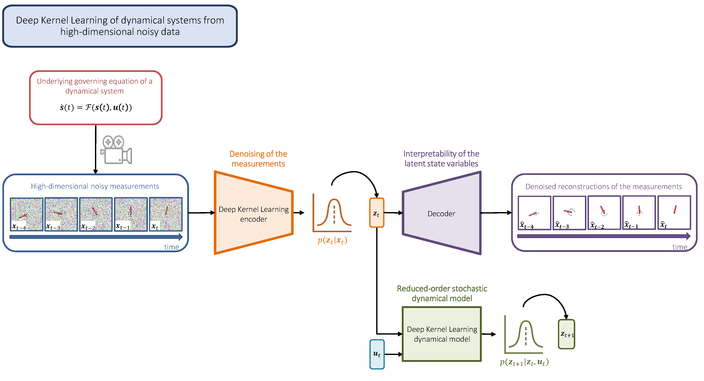

# Deep Kernel Learning of Dynamical Models

Code accompanying the paper:

**Deep Kernel Learning of Dynamical Models from High-Dimensional Noisy Data**\
Nicolò Botteghi, Mengwu Guo, Christoph Brune,
The can be found at: [Link](https://arxiv.org/pdf/2208.12975.pdf).



**Abstract:** 
This work proposes a Stochastic Variational Deep Kernel Learning method for the data-driven discovery of low-dimensional dynamical models from high-dimensional noisy data.
The framework is composed of an encoder that compresses high-dimensional measurements into low-dimensional state variables, and a latent dynamical model for the state variables that predicts the system evolution over time. The training of the proposed model is carried out in an unsupervised manner, i.e., not relying on labeled data.
Our learning method is evaluated on the motion of a pendulum -- a well studied baseline for nonlinear model identification and control with continuous states and control inputs -- measured via high-dimensional noisy RGB images. Results show that the method can effectively denoise measurements, learn compact state representations and latent dynamical models, as well as identify and quantify modeling uncertainties.

## Requirements

* Python 3.8
* Pytorch (version 1.11 + CUDA 11.3)
* pip install -r requirements.txt

## Generate datasets

**Pendulum**:
```bash
python generate_dataset.py --env_name='Pendulum-v1' --training-dataset='pendulum_train.pkl' --seed=1

python generate_dataset.py --env_name='Pendulum-v1' --training-dataset='pendulum_train.pkl' --seed=2
```

## Train the model
```bash
python SVDKL-AE.py --training-dataset='pendulum_train.pkl' --testing-dataset='pendulum_test.pkl'
```

## Cite
If you use this code in your own work, please cite our papers:
```
@article{botteghi2022deep,
  title={Deep Kernel Learning of Dynamical Models from High-Dimensional Noisy Data},
  author={Botteghi, Nicol{\`o} and Guo, Mengwu and Brune, Christoph},
  journal={arXiv preprint arXiv:2208.12975},
  year={2022}
}

```

